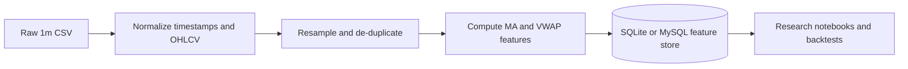

# Schema

Primary table: `ohlcv_features_1m`

Primary key: `timestamp`

Base columns:

- `timestamp`
- `unix`
- `open`
- `high`
- `low`
- `close`
- `vwap`
- `ETH_volume`
- `USD_volume`
- `moving_average`
- `slope`
- `VWAP_slope`

Feature families for periods `13, 21, 50, 100, 200`:

- `ma_N`
- `ma_slope_N`
- `ma_slope_of_slope_N`
- `ma_slope_norm_N`
- `ma_slope_of_slope_norm_N`
- `vwap_N`
- `vwap_slope_N`
- `vwap_slope_of_slope_N`
- `vwap_slope_norm_N`
- `vwap_slope_of_slope_norm_N`

